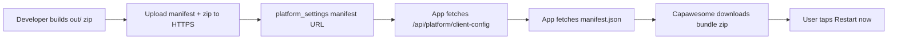

# OTA live updates (Capacitor / sideload APK)

Ship **web-only fixes** to installed APKs without rebuilding the native shell. Native or plugin changes still require a **new APK** and a higher **min native build**.

## How it works



| Layer | What updates | How |
|-------|----------------|-----|
| **OTA (this doc)** | HTML/JS/CSS in `out/` | Hosted zip + manifest |
| **APK reinstall** | Capacitor, plugins, permissions | New APK + `min_native_build` |

---

## One-time setup (you do this once)

### 1. Install the native plugin

From `web/`:

```powershell
npm install
npx cap sync android
```

Open Android Studio and rebuild the APK so `@capawesome/capacitor-live-update` is embedded.

### 2. Set native build number on each APK release

When shipping a **new APK**, bump the build number baked into the bundle:

```powershell
$env:NEXT_PUBLIC_NATIVE_BUILD="2"
$env:NEXT_PUBLIC_API_BASE_URL="https://isopro.me"
npm run build:capacitor
```

Then build/sign the APK in Android Studio.

### 3. Ensure Supabase has `platform_settings`

Run migration `20260520143000_global_announcements_platform_settings.sql` if not already applied (creates `platform_settings` with `min_native_build`, `live_update_channel`, `live_update_bundle_url`).

---

## Releasing an OTA web update (routine)

### Step 1 — Build the Capacitor web bundle

```powershell
cd web
$env:NEXT_PUBLIC_API_BASE_URL="https://isopro.me"
$env:NEXT_PUBLIC_NATIVE_BUILD="2"   # match your current APK
npm run build:capacitor
```

### Step 2 — Package zip + manifest

```powershell
$env:OTA_BUNDLE_ID="20260520.1"
$env:OTA_CHANNEL="production"
$env:OTA_PUBLIC_BASE_URL="https://isopro.me/ota/production"
$env:OTA_MIN_NATIVE_BUILD="2"
$env:OTA_RELEASE_NOTES="Fix inbox mark-read and report loading"
npm run package:ota
```

Output: `web/ota-dist/production/manifest.json` and `bundle-20260520.1.zip`.

### Step 3 — Publish to your site (isopro.me)

```powershell
npm run publish:ota:public
```

This copies files into `public/ota/production/` so they deploy with your Next.js site.

Then deploy the web app (Vercel/hosting push) so these URLs work:

- `https://isopro.me/ota/production/manifest.json`
- `https://isopro.me/ota/production/bundle-20260520.1.zip`

**Or** upload `ota-dist/production/*` manually to any HTTPS static host.

### Step 4 — Point the platform at the manifest

**Developer console** → **Live update controls** → set:

- **Manifest URL**: `https://isopro.me/ota/production/manifest.json`
- **OTA channel**: `production`
- **Minimum native build**: `2` (lowest APK build allowed to use OTA)

Or run `supabase/ops/seed_ota_platform_settings.sql` in Supabase SQL editor.

```sql
UPDATE public.platform_settings
SET
  live_update_bundle_url = 'https://isopro.me/ota/production/manifest.json',
  live_update_channel = 'production',
  min_native_build = 2,
  updated_at = now()
WHERE id = 'default';
```

### Step 5 — Verify on a device

1. Install APK with `NEXT_PUBLIC_NATIVE_BUILD=2`.
2. Open app **online**.
3. Within minutes, you should get **“App update ready”** → **Restart now**.

---

## Manifest format

```json
{
  "bundleId": "20260520.1",
  "version": "20260520.1",
  "channel": "production",
  "minNativeBuild": 2,
  "bundleUrl": "https://isopro.me/ota/production/bundle-20260520.1.zip",
  "publishedAt": "2026-05-20T14:00:00.000Z",
  "releaseNotes": "Optional text shown in the restart prompt"
}
```

- **bundleId** — must change every release (used to skip re-downloads).
- **bundleUrl** — direct HTTPS link to the zip of the `out/` folder contents.
- **minNativeBuild** — devices below this see the APK reinstall modal instead.

---

## When to bump what

| Change | Action |
|--------|--------|
| UI copy, forms, workspace JS | OTA only |
| New Capacitor plugin / permission | New APK + bump `min_native_build` |
| Capacitor major upgrade | New APK + bump `min_native_build` |

---

## What you can do to help

1. **Pick OTA hosting** — e.g. `https://isopro.me/ota/production/` (folder on your site).
2. **Rebuild APK once** with the Live Update plugin (`npm install`, `cap sync`, Android Studio build).
3. **Tell us your production URL** so `OTA_PUBLIC_BASE_URL` matches.
4. **Run a test OTA** — build, package, upload, set manifest URL in admin console, confirm restart prompt on a phone.

---

## Troubleshooting

| Symptom | Check |
|---------|--------|
| No update prompt | Manifest URL in admin? Device online? `bundleId` newer than last applied? |
| “App update required” (APK) | Device build &lt; `min_native_build` — install new APK |
| Download fails | `bundleUrl` reachable in browser? HTTPS valid? |
| OTA never runs on web | Expected — OTA only runs in Capacitor native shell |
